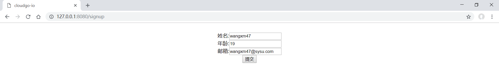
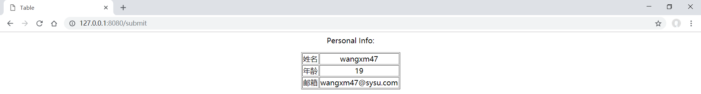

# cloudgo-io

### 1.简单支持JS访问

**js代码:**

```JavaScript
$(document).ready(function(){
    $("#IG").css({"width":$("body").width()});
    alert("IG NB!!!!!!!");
})
```

**结果:**


----------------------------------------------


### 2. 静态文件服务

**路由代码:**

```go
mx.PathPrefix("/static").Handler(http.StripPrefix("/static/",http.FileServer(http.Dir(webRoot+"/assets/"))))
```

**结果(获取`http://127.0.0.1:8080/static/image/1.jpg`):**


-------------------------------------------------

### 3. 简单表单处理和模板输出

**表单页面** 

```html
<!--表单填写提交页面-->
<html>

<head>
  <title>cloudgo-io</title>
  <meta http-equiv="Content-Type" content="text/html; 
    charset=utf-8">
  <link rel="stylesheet" href="static/css/hello.css" />
</head>

<body>
  <br>
  <div id="d">
    <form name="myform" action="/submit" method="post">
      姓名:<input type="text" name="name"><br>
      年龄:<input type="text" name="age"><br>
      邮箱:<input type="text" name="email"><br>
      <button>提交</button>
    </form>
  </div>
</body>

</html>
```

**路由和handler:**

```go
//路由
mx.HandleFunc("/submit", submitHandler(formatter))
//submitHandler
func submitHandler(formatter *render.Render) http.HandlerFunc {
	return func(w http.ResponseWriter, r *http.Request) {
		r.ParseForm()

		name := r.FormValue("name")
		age := r.FormValue("age")
		email := r.FormValue("email")

		formatter.HTML(w, http.StatusOK, "table", struct {
			Name  string
			Age   string
			Email string
		}{Name: name, Age: age, Email: email})
	}
}
```

**作为响应返回的`table.html` :**

```html
<!--响应-->
<html>

<head>
    <meta charset="utf-8">
    <title>Table</title>
    <link rel="stylesheet" href="static/css/table.css" />
</head>

<body>
    <p>Personal Info: </p>
    <table border="1">
        <tr>
            <td>姓名</td>
            <td>{{.Name}}</td>
        </tr>
        <tr>
            <td>年龄</td>
            <td>{{.Age}}</td>
        </tr>
        <tr>
            <td>邮箱</td>
            <td>{{.Email}}</td>
        </tr>
    </table>
</body>

</html>
```

**结果:**

* 填写表单

  

* 提交,响应

  